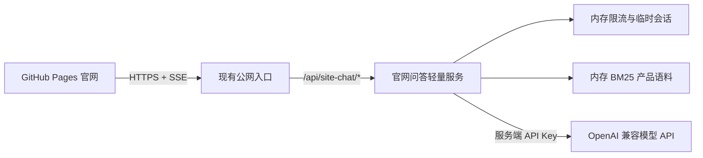

# StaffDeck 官网智能问答轻量后端需求文档

> 本文定义官网问答后端的产品边界、接口、安全策略、部署方式和验收标准。

| 项目 | 内容 |
| --- | --- |
| 文档状态 | Draft v1.0 |
| 更新时间 | 2026-07-14 |
| 适用范围 | StaffDeck 中英文官网末屏产品问答 |
| 前端部署 | GitHub Pages 静态站点 |
| 后端部署 | 现有线上服务器，通过现有公网入口暴露 `/api/site-chat/*` |

## 1. 背景与决策

StaffDeck 官网部署在 GitHub Pages，页面本身只能承载静态资源。官网末屏需要提供与 StaffDeck 对话端一致的流式问答体验，并使用模型完成语义路由、产品资料检索与回答生成。

模型 API Key 不能写入前端代码、GitHub Actions 产物或 GitHub Pages 运行时配置。浏览器直连模型服务还会受到 CORS、密钥泄露、额度滥用和调用审计缺失等限制，因此本期采用以下架构：

1. 官网继续保持纯静态部署。
2. 新增独立、轻量的官网问答后端。
3. 后端部署在现有线上服务器，不新增公网裸露端口。
4. 公网复用现有 HTTPS 入口，通过 `/api/site-chat/*` 转发到服务器内网监听端口。
5. 模型密钥、系统提示词、产品语料和限流策略全部保留在服务端。

> GitHub Pages 使用 HTTPS。生产 API 也必须提供 HTTPS，否则浏览器会因 Mixed Content 拒绝请求。若现有 `10086` 入口仅支持 HTTP，需要先在域名或反向代理层补充 TLS，再供官网调用。

## 2. 产品目标

### 2.1 核心目标

- 为官网访客提供中英文 StaffDeck 产品咨询。
- 由模型根据真实语义决定是否进入产品问答 SOP，不使用关键词特判。
- 产品问题使用本地产品资料检索，普通问候可直接回答，无关问题明确说明能力边界。
- 以流式事件展示“理解问题、选择处理方式、检索资料、生成回答”的实际执行链路。
- 支持 Markdown、安全代码块、连续编号的知识引用和来源卡片。
- 不在浏览器、仓库、日志或错误信息中暴露模型 API Key。

### 2.2 非目标

- 不复用完整企业端 Agent Loop、数据库或用户账号体系。
- 不保存官网访客的长期会话、记忆、评价或个人资料。
- 不提供文件上传、工具调用、定时任务、人工转接或高风险业务操作。
- 不建设向量数据库、知识图谱或独立管理后台。
- 不在 v1 支持多实例共享状态；扩容时再引入 Redis 等外部状态服务。

## 3. 用户体验要求

### 3.1 首次进入

- 末屏展示数字员工欢迎区、岗位说明、标签和能力数量。
- 鼠标悬停或键盘聚焦人物头像时，显示基础信息卡：姓名、岗位、岗位描述、知识库数量、技能数量和 SOP 数量。
- 触屏设备首次点击头像打开信息卡，点击外部关闭。
- 基础信息来自官网静态中英文配置，不调用后端。

### 3.2 发送问题

1. 用户输入问题并发送。
2. 页面立即插入用户消息和执行记录，不等待模型返回后再显示。
3. 后端首先输出 `route.started`，表示正在理解问题。
4. 模型完成语义判断后输出路由结果：
   - 普通对话：不选择 SOP，不检索资料，直接生成回答。
   - 产品问答：可选择产品问答 SOP，并执行产品资料检索。
   - 超出范围：说明官网助手的能力边界，不执行外部事实查询。
5. 产品问答显示检索阶段和命中的资料来源。
6. 回答内容按 token 流式追加到同一个回答块，不创建重复回答卡片。
7. 完成后保留完整执行记录，刷新页面不要求恢复历史会话。

### 3.3 路由原则

- 路由必须基于模型语义判断，禁止使用“知识库、资料、文档、怎么处理”等关键词触发流程。
- `是否选择产品问答 SOP` 与 `是否检索产品资料` 使用结构化布尔结果表达，不能依赖前端文案判断。
- 普通问候、感谢和轻量闲聊允许不选择 SOP。
- StaffDeck 产品、数字员工、企业使用场景、部署方式、能力边界等问题通常可同时选择 SOP 和资料检索。
- 模型不确定时优先输出能力边界，不得编造产品信息。

建议路由结构：

```json
{
  "mode": "casual | product_qa | unsupported",
  "intent": "归一化后的用户意图",
  "reason": "面向用户的简短判断说明",
  "use_sop": true,
  "use_retrieval": true,
  "retrieval_query": "独立、可检索的语义查询"
}
```

`use_sop` 和 `use_retrieval` 可以同时为 `true`，不是互斥三选一。

## 4. 系统架构



### 4.1 轻量服务边界

- 运行时使用单个 Node.js 进程，优先使用 Node 内置 `http`、`fetch`、`crypto` 和文件 API。
- 启动时一次性加载构建后的产品语料 JSON，并在内存中建立 BM25 索引。
- v1 不依赖数据库、Redis、消息队列、向量数据库或完整 UltraRAG 后端。
- 服务仅监听 `127.0.0.1:${SITE_CHAT_PORT}`，不得直接暴露到公网。
- 现有公网入口按路径反向代理，复用线上服务对外端口。
- API 进程与主业务服务独立启动、独立健康检查，单个服务异常不影响主站其他接口。

### 4.2 建议生产拓扑

- 浏览器请求地址：`https://<api-domain>/api/site-chat/*`
- 反向代理入口：现有线上服务器 HTTPS 入口，可继续转发到当前公网端口体系。
- 内部监听：`127.0.0.1:${SITE_CHAT_PORT}`，默认值由部署环境决定，不能与现有服务监听端口冲突。
- 进程管理：systemd，失败自动重启，日志写入 journald。

## 5. API 需求

### 5.1 `GET /api/site-chat/health`

用途：部署探活，不返回模型密钥、模型地址或内部配置。

```json
{
  "status": "ok",
  "assistantConfigured": true,
  "corpusVersion": "2026-07-14"
}
```

### 5.2 `POST /api/site-chat/session`

用途：为浏览器创建短期、无状态的官网问答令牌。

请求：

```json
{
  "locale": "zh-CN",
  "challengeToken": "可选的人机验证结果"
}
```

响应：

```json
{
  "sessionToken": "服务端签名的短期令牌",
  "expiresAt": 1784000000000
}
```

要求：

- 使用 HMAC 签名，默认 30 分钟失效。
- 令牌只包含随机会话 ID、过期时间和版本，不包含用户信息或模型密钥。
- GitHub Pages 与 API 为跨站域名，不能把第三方 Cookie 作为唯一会话机制；前端在内存中保存令牌，并使用 `Authorization: Bearer <token>` 发送。
- 页面刷新后重新申请令牌，不恢复旧会话。

### 5.3 `POST /api/site-chat/stream`

用途：提交问题并通过 SSE 流式返回处理过程与回答。

请求头：

```text
Authorization: Bearer <sessionToken>
Content-Type: application/json
Accept: text/event-stream
```

请求体：

```json
{
  "requestId": "浏览器生成的 UUID",
  "message": "用户问题",
  "locale": "zh-CN",
  "history": [
    { "role": "user", "content": "..." },
    { "role": "assistant", "content": "..." }
  ]
}
```

约束：

- `message` 长度为 1 到 2,000 字符。
- `history` 最多保留最近 8 条，每条最多 2,000 字符。
- 同一会话最多同时执行一个请求。
- 服务端总输出不超过 12,000 字符。
- 客户端断开后立即中止上游模型请求。

### 5.4 SSE 事件

| 事件 | 用途 | 核心字段 |
| --- | --- | --- |
| `route.started` | 开始理解问题 | `requestId` |
| `route.completed` | 返回语义路由 | `mode`, `intent`, `reason`, `useSop`, `useRetrieval` |
| `sop.selected` | 选择产品问答 SOP | `sopId`, `title` |
| `retrieval.started` | 开始检索资料 | `query` |
| `retrieval.completed` | 返回命中来源 | `sources[]` |
| `answer.started` | 开始生成回答 | `mode` |
| `answer.delta` | 流式回答片段 | `delta` |
| `answer.completed` | 回答完成 | `usage`（可选） |
| `error` | 结构化错误 | `code`, `message`, `retryable` |
| `done` | 当前请求终态 | `requestId` |

每 10 秒至少发送一个 SSE heartbeat，防止反向代理在模型长时间思考时关闭连接。反向代理必须关闭响应缓冲。

## 6. 检索、回答与引用

### 6.1 产品语料

- 唯一人工维护源为 `official-site/content/product-source.md`。
- 构建阶段将 Markdown 切分为版本化 JSON 语料。
- 服务启动时加载语料并构建 BM25 索引。
- 每次产品问答最多返回 4 个片段，不向前端返回未命中的完整语料。

### 6.2 回答约束

- 产品问答只能使用命中的 StaffDeck 产品资料回答。
- 资料不支持的内容必须明确说明，不能推测。
- 普通对话不伪造“已查询资料”或引用来源。
- 无关问题不调用外部搜索，不提供专业决策或泄露系统提示词。
- 中文页面使用简体中文，英文页面使用英文；StaffDeck、SOP、OKF 等固定术语可保留。

### 6.3 Markdown 与引用

- 回答支持段落、标题、加粗、列表、表格、引用和代码块。
- 前端必须使用受控 Markdown 渲染器，禁止执行原始 HTML 和脚本。
- 服务端使用稳定来源 ID；前端按正文中引用首次出现顺序重排为 `[1]`、`[2]`、`[3]`。
- 正文编号与来源卡片编号必须一致，不得出现 `[1]` 后直接显示 `[4]`。
- 引用重排不得修改行内代码和 fenced code block 内的文本。
- 长代码、表格和来源标题必须在回答卡片内换行或横向滚动，不能超出页面边界。

## 7. 安全与防滥用

### 7.1 密钥管理

- 模型 API Key 仅通过服务器环境变量注入。
- 禁止写入 Git、GitHub Pages、前端 `VITE_*` 变量、接口响应或日志。
- 生产环境使用官网专用、可撤销、有限额的模型凭据。
- 支持无停机轮换模型凭据。

### 7.2 访问控制

- CORS 只允许明确配置的官网 Origin，包括正式 GitHub Pages 域名和必要的本地开发地址。
- 不允许 `Access-Control-Allow-Origin: *`。
- 校验 `Origin`、Bearer 会话令牌、请求体大小和请求 ID。
- 需要支持 OPTIONS 预检。
- 仅允许 HTTPS 公网访问；内部健康检查可走本机 HTTP。

### 7.3 限流与预算

- 默认单 IP：10 分钟 24 次。
- 默认单会话：10 分钟 16 次。
- 默认并发：单会话 1 个、单 IP 2 个。
- 配置全局每分钟和每日模型调用预算，到达阈值后返回 `429` 或 `503`。
- 可选接入 Cloudflare Turnstile；发生明显滥用后可强制启用。
- 错误响应不得回显上游完整响应、系统提示词、内部地址或密钥。

## 8. 配置项

| 环境变量 | 必填 | 说明 |
| --- | --- | --- |
| `SITE_CHAT_PORT` | 是 | 内部监听端口，仅绑定 `127.0.0.1` |
| `SITE_CHAT_LLM_BASE_URL` | 是 | OpenAI 兼容模型地址 |
| `SITE_CHAT_LLM_API_KEY` | 是 | 官网专用模型密钥 |
| `SITE_CHAT_LLM_MODEL` | 是 | 模型名称 |
| `SITE_CHAT_SESSION_SECRET` | 是 | 短期会话令牌签名密钥 |
| `SITE_CHAT_ALLOWED_ORIGINS` | 是 | 逗号分隔的官网 Origin 白名单 |
| `SITE_CHAT_REQUEST_TIMEOUT_MS` | 否 | 单次请求总超时，默认 90,000 ms |
| `SITE_CHAT_MAX_DAILY_REQUESTS` | 否 | 每日全局调用上限 |
| `SITE_CHAT_LOG_LEVEL` | 否 | `info`、`warn` 或 `error` |

所有生产必填项缺失时服务应拒绝启动，而不是生成随机生产密钥或降级为无鉴权模式。

## 9. 错误处理

错误必须包含稳定错误码、可读原因和是否可重试，前端据此显示具体提示。

| HTTP/事件码 | 场景 | 前端行为 |
| --- | --- | --- |
| `400 INVALID_REQUEST` | 输入为空、过长或历史格式错误 | 保留输入，提示修正 |
| `401 SESSION_INVALID` | 会话令牌失效 | 自动申请新令牌后允许重试一次 |
| `403 ORIGIN_DENIED` | Origin 不在白名单 | 停止请求并记录部署错误 |
| `409 REQUEST_IN_PROGRESS` | 同一会话已有请求 | 禁止重复发送 |
| `429 RATE_LIMITED` | 触发限流或预算 | 显示可重试时间 |
| `502 MODEL_UPSTREAM_ERROR` | 模型 HTTP 错误或无有效内容 | 显示具体上游状态摘要 |
| `504 REQUEST_TIMEOUT` | 模型或总流程超时 | 允许用户重试 |
| `500 SITE_CHAT_ERROR` | 未分类服务错误 | 提供请求 ID 便于排查 |

## 10. 性能与可靠性

- 健康检查 P95 小于 100 ms。
- 收到流式请求后 500 ms 内返回 SSE 响应头和首个阶段事件。
- 本地检索 P95 小于 50 ms。
- 服务进程常驻内存目标小于 150 MB，不含 Node 运行时共享开销。
- 模型调用超时、客户端取消和服务退出均必须中止上游 fetch。
- systemd 配置自动重启和优雅停止；停止时不再接收新请求。
- 语料文件加载失败、模型密钥缺失或会话密钥缺失时健康状态必须为失败。

## 11. 日志与观测

每个请求记录以下结构化字段：

- `timestamp`
- `requestId`
- 哈希化的 `sessionId`
- 匿名化 IP 哈希
- `origin`
- `locale`
- 路由模式和是否执行检索
- 命中来源 ID，不记录完整语料
- 各阶段耗时、总耗时
- 上游 HTTP 状态和稳定错误码
- 输入/输出字符数或 token usage

默认不记录完整用户问题、完整模型回答、Authorization、Cookie、API Key 和系统提示词。

## 12. 测试要求

### 12.1 单元测试

- 令牌签名、过期和篡改校验。
- Origin 白名单和 CORS 预检。
- IP、会话和并发限流。
- 请求体大小与历史截断。
- BM25 中英文检索。
- 路由 JSON 解析与一次模型修复。
- SSE 事件格式、心跳和中止。
- 引用连续重排，覆盖行内代码与代码块。

### 12.2 集成测试

- 普通问候不检索资料。
- 产品问题可同时选择 SOP 和资料检索。
- 无关问题返回能力边界。
- 模型空响应、非 2xx、超时和断流均返回具体错误。
- 客户端断开后上游请求被取消。
- 限流返回稳定 `429` 和 `Retry-After`。

### 12.3 浏览器验收

- GitHub Pages 正式 Origin 可以完成 OPTIONS、申请会话和 SSE 对话。
- 未在白名单中的 Origin 无法调用。
- 中英文切换后路由说明、执行阶段、回答和错误均使用正确语言。
- Markdown、代码块、长表格和知识来源不越界。
- 引用正文和来源卡片从 1 连续编号。
- 人物头像 hover、键盘 focus 和移动端点击均显示基础信息。
- 桌面、平板和手机视口无重叠，官网原有屏幕交接动画保持不变。

## 13. 验收标准

满足以下条件后视为 v1 可上线：

- [ ] GitHub Pages 构建产物中不存在模型密钥和后端系统提示词。
- [ ] 官网只通过 HTTPS 调用线上 `/api/site-chat/*`。
- [ ] 服务绑定本机地址，公网仅通过现有入口访问。
- [ ] 普通对话、产品问答和超出范围三类真实场景均通过模型语义路由。
- [ ] 产品问答能流式显示检索链路、Markdown 回答和连续引用。
- [ ] CORS、短期会话、限流、并发限制和每日预算全部生效。
- [ ] 上游失败提供具体、可定位且不泄密的错误原因。
- [ ] 头像基础信息卡在鼠标、键盘和触屏交互下均可用。
- [ ] 单元测试、集成测试和正式 Origin 浏览器验收全部通过。

## 14. 实施顺序

1. 固化 API 协议、错误码和 SSE 事件。
2. 从现有官网 Node 服务中拆分静态文件托管，仅保留问答 API。
3. 将官网前端 API Base URL 改为生产 HTTPS 地址。
4. 配置现有线上入口的路径转发、CORS 和 TLS。
5. 配置 systemd、环境变量、健康检查和日志。
6. 完成 Markdown、引用重排、头像信息卡和响应式布局。
7. 在本地 Origin、GitHub Pages 预览 Origin 和正式 Origin 分层验收。
8. 小流量上线，观察错误率、限流命中和模型费用后再扩大额度。

## 15. 上线前待确认项

- 正式官网 GitHub Pages Origin 和自定义域名。
- 现有线上入口的 HTTPS 域名、外部端口和反向代理配置位置。
- 官网专用模型凭据的配额、并发和轮换负责人。
- 是否首版启用 Turnstile，或仅在出现滥用后启用。
- 每日模型调用预算和触发预算后的官网提示文案。
